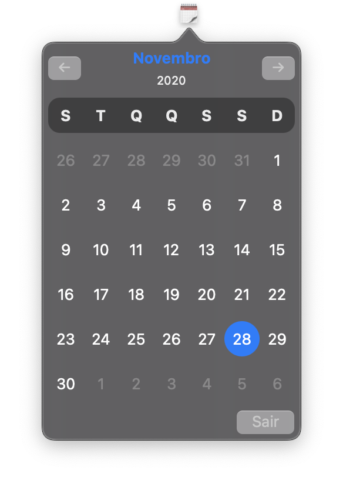

# CalMenu

A simple, yet useful, menu extras item to show the current month on macOS 10.15+.

    
    

## [1.1.0] - 2021-04-04

### Added
- Option for running the app on startup
- Option to record a shortcut to toggle the popover view
- Sparkle update system

## [1.0.3] - 2020-11-28

### Changed
- Improved layout to fix some bugs running on Big Sur
- Should be compatible with M1 macs, I do not own one to test

## [1.0.2] - 2020-09-16

### Fixed
- Wrong first day if week, now it follows what is set on preferences

## [1.0.1] - 2020-09-16

### Changed
- The binary is now notarized

### Fixed
- Layout issues
- Previous/Next month icon not showing

## [1.0.0] - 2020-08-21

### Added
- Dark mode support
- Supported languages:
    - English
    - Brazilian Portuguese
